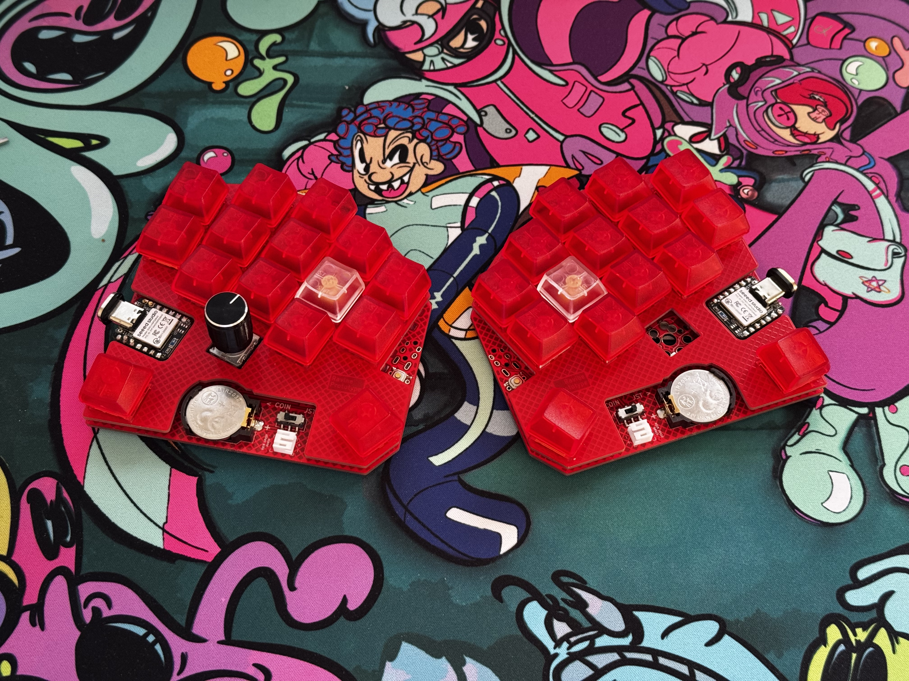
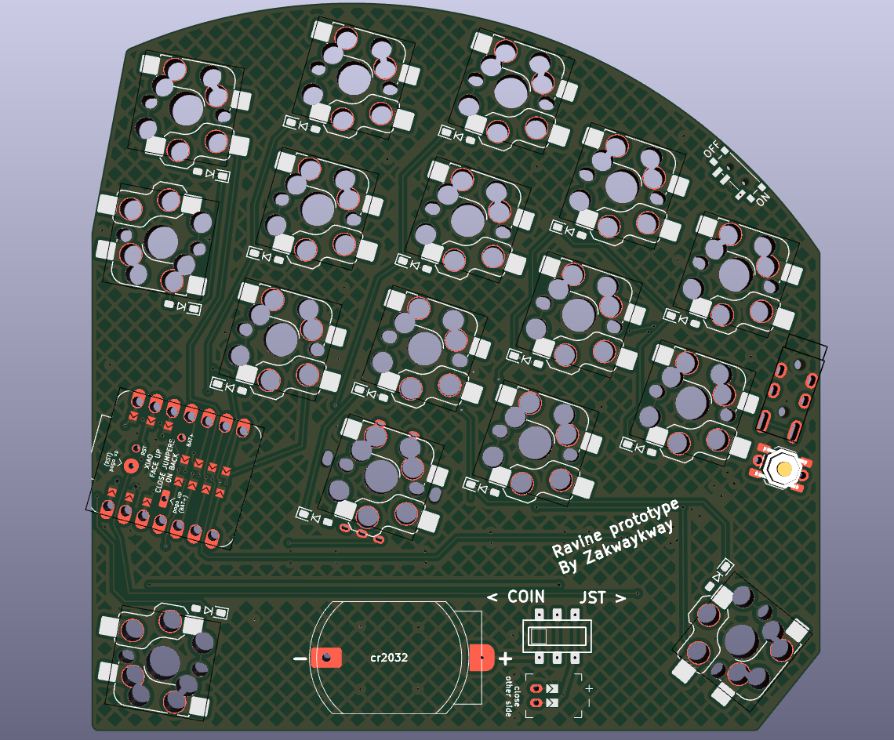

# Ravine

A split, hummingbird-inspired, ergogenerated 30% keyboard, with a palm key.

v2 is planned.

## Features
  - 23332+1 plus a palm key, for a 6th point of contact,
  - Reversible & 100x100mm (very cheap), 
  - Simultaneous hotswap compatibility with chocv1, v2, and MX,
  - Optional rotary encoder on each half,
  - Xiao nRF52840 (wireless) MCU,
  - Compatibility with a 2032 coin cell AND jst-connected lipo.

The pcb in v1/production is tested; completely functional with xiao nrf52840.

## Notes
1. There is a TRRS connector footprint: it is NOT FUNCTIONAL, until ZMK supports [half-duplex (single-wire) UART](https://zmk.dev/docs/features/split-keyboards#full-duplex-wired-uart) support. **No** wired split.wb
2. On the **right** half's **front**, the battery swapper switch's silkscreen reads: \<COIN   JST\>. This is incorrect. To select a battery, the slider should be set **closest to the desired battery**, on both halves. (Out for coins, in for JSTs.)
3. I find it the palm key to be a little bit cramped, due to the 100x100 size. I'll definitely make it wider on v2.

## Assembly

### Components
- todo

### Build guide
1. On **back** face: tin 1 pad on each diode, and on each planned hotswap socket. (simultaneous Choc & MX is possible!)
If you plan on using an encoder, do not tin the socket pads there.'
2. Insert all hotswap sockets, and reflow their tinned pads.
3. For diodes, I place and reflow one at a time, because they are a lot smaller & tend to jump around.
4. Then, solder diodes' and sockets' 2nd (untinned) pads.
5. **Still on back face:** close MCU's jumpers, and JST's jumpers.
6. On **front** face: solder reset button, power switch slider, and MCU sockets.
7. Notes for battery and connectors: 
- If planning on only using JST, I suggest **not** adding the coin holder, as there's virtually no space for a battery (unless the encoder's spot is unpopulated). 
I have 302025, which fits, but is really at the limit. You'll want a battery 3mm thick or less (xx30xx), in order for it to fit under the plate.
- If using a coin cell, ensure it is rechargeable. Xiao nrf52840 has a charging circuit, which **CAN MAKE BAD THINGS HAPPEN** to non-rechargeable batteries.
- If you are **not** planning on using both battery types, it is safe to bodge the **slider**'s center pads with the correct pads, instead of using a slider. **SEE NOTE 2**
8. Considering the above, solder JST &or coin cell holder & battery selection slider switch.
9. Solder pogos. If male pins aren't soldered to the mcu yet, do that BEFORE adding pogos—doing it after is very tedious and annoying.
10. **Enjoy your new keyboard!** Send me pics, suggestions, or comments @zakwaykway on discord \:))

ZMK module (wireless firmware) can be found at [zmk-keyboard-ravine](https://github.com/zakwaykway/zmk-keyboard-ravine).

## Thanks:
Initial ergogen configuration inspired by ezxzeng's sweep_squared_rot.
Impossible without ergogen, zmk, and the many who have open-sourced the footprints, pcbs, and firmwares I've consulted for inspiration and guidance. Thank you.